# AI Resume Matcher - Application Flow Diagrams

## Complete Web Sequence Diagram

This diagram shows the detailed interaction flow between all components of the AI Resume Matcher application.

```mermaid
sequenceDiagram
    participant User
    participant StreamlitUI as Streamlit UI
    participant DataPipeline as Data Pipeline
    participant ResumeProcessor as Resume Processor
    participant JobProcessor as Job Processor
    participant LangChainAgents as LangChain Agents
    participant LLMService as LLM Service (Groq)
    participant PromptManager as Prompt Manager
    participant EmbeddingService as Embedding Service
    participant VectorStore as Vector Store (ChromaDB)
    participant FileUtils as File Utils

    %% Application Startup
    User->>StreamlitUI: Launch Application
    StreamlitUI->>StreamlitUI: Initialize StreamlitApp()
    StreamlitUI->>ResumeProcessor: Initialize resume_processor
    StreamlitUI->>JobProcessor: Initialize job_processor
    StreamlitUI->>DataPipeline: Initialize data_pipeline
    StreamlitUI->>User: Display Navigation Menu

    %% Resume Upload & Processing Flow
    alt Resume Upload Flow
        User->>StreamlitUI: Select "Resume Upload" Page
        User->>StreamlitUI: Upload Resume Files (PDF/DOCX/TXT)
        StreamlitUI->>StreamlitUI: Save files to temp directory
        
        loop For each resume file
            StreamlitUI->>ResumeProcessor: process_resume_file(file_path)
            ResumeProcessor->>FileUtils: extract_text_from_file(file_path)
            FileUtils-->>ResumeProcessor: extracted_text
            
            ResumeProcessor->>LangChainAgents: parse_resume_content(text)
            LangChainAgents->>PromptManager: get_resume_parsing_prompt()
            PromptManager-->>LangChainAgents: resume_prompt_template
            
            LangChainAgents->>LLMService: invoke_chain(prompt + text)
            LLMService->>LLMService: Call Groq API (gemma2-9b-it)
            LLMService-->>LangChainAgents: structured_resume_data
            
            LangChainAgents->>LangChainAgents: _clean_json_response(response)
            LangChainAgents->>LangChainAgents: Parse with Pydantic (ResumeParsingOutput)
            LangChainAgents-->>ResumeProcessor: ResumeData object
            
            ResumeProcessor->>EmbeddingService: generate_embedding(resume_text)
            EmbeddingService-->>ResumeProcessor: embedding_vector
            
            ResumeProcessor->>VectorStore: store_resume(resume_data, embedding, metadata)
            Note over VectorStore: Metadata: skills→string, experience_years→int
            VectorStore-->>ResumeProcessor: storage_success
            
            ResumeProcessor-->>StreamlitUI: ResumeData
            StreamlitUI->>StreamlitUI: Display resume summary
            StreamlitUI->>FileUtils: cleanup_temp_file(temp_path)
        end
        
        StreamlitUI->>User: Show processing results & resume list
    end

    %% Job Management Flow
    alt Job Management Flow
        User->>StreamlitUI: Select "Job Management" Page
        User->>StreamlitUI: Enter job details (title, company, description)
        StreamlitUI->>JobProcessor: process_and_store_job(job_text, title, company)
        
        JobProcessor->>LangChainAgents: parse_job_description(job_text)
        LangChainAgents->>PromptManager: get_job_parsing_prompt()
        PromptManager-->>LangChainAgents: job_prompt_template
        
        LangChainAgents->>LLMService: invoke_chain(prompt + job_text)
        LLMService->>LLMService: Call Groq API (gemma2-9b-it)
        LLMService-->>LangChainAgents: structured_job_data
        
        LangChainAgents->>LangChainAgents: _clean_json_response(response)
        LangChainAgents->>LangChainAgents: Parse with Pydantic (JobParsingOutput)
        LangChainAgents-->>JobProcessor: JobDescription object
        
        JobProcessor->>EmbeddingService: generate_embedding(job_description)
        EmbeddingService-->>JobProcessor: embedding_vector
        
        JobProcessor->>VectorStore: store_job(job_data, embedding, metadata)
        Note over VectorStore: Metadata: required_skills→string, experience_years→int
        VectorStore-->>JobProcessor: storage_success
        
        JobProcessor->>JobProcessor: Save job to JSON file (data/jobs/)
        JobProcessor-->>StreamlitUI: JobDescription
        StreamlitUI->>StreamlitUI: Display job summary
        StreamlitUI->>User: Show saved job confirmation
    end

    %% Job Matching Flow
    alt Job Matching Flow
        User->>StreamlitUI: Select "Job Matching" Page
        StreamlitUI->>JobProcessor: list_stored_jobs()
        JobProcessor-->>StreamlitUI: available_jobs_list
        StreamlitUI->>User: Display job selection dropdown
        
        User->>StreamlitUI: Select job + set top_k candidates
        User->>StreamlitUI: Click "Find Matches"
        
        StreamlitUI->>JobProcessor: get_job_data(job_id)
        JobProcessor-->>StreamlitUI: JobDescription
        
        StreamlitUI->>ResumeProcessor: find_best_matches(job_data, top_k)
        ResumeProcessor->>VectorStore: search_similar_resumes(job_embedding, top_k)
        VectorStore-->>ResumeProcessor: similar_resume_candidates
        
        loop For each candidate
            ResumeProcessor->>LangChainAgents: analyze_match_compatibility(resume, job)
            LangChainAgents->>PromptManager: get_matching_prompt()
            PromptManager-->>LangChainAgents: matching_prompt_template
            
            LangChainAgents->>LLMService: invoke_chain(prompt + resume + job)
            LLMService->>LLMService: Call Groq API for match analysis
            LLMService-->>LangChainAgents: match_analysis_result
            
            LangChainAgents->>LangChainAgents: Parse with Pydantic (MatchAnalysisOutput)
            LangChainAgents-->>ResumeProcessor: MatchResult object
        end
        
        ResumeProcessor-->>StreamlitUI: ranked_match_results
        StreamlitUI->>StreamlitUI: Create match visualizations (charts)
        StreamlitUI->>StreamlitUI: Display detailed match results
        StreamlitUI->>User: Show top candidates with scores & explanations
    end

    %% Analytics Flow
    alt Analytics Flow
        User->>StreamlitUI: Select "Analytics" Page
        StreamlitUI->>ResumeProcessor: list_processed_resumes()
        ResumeProcessor-->>StreamlitUI: resume_analytics_data
        
        StreamlitUI->>JobProcessor: list_stored_jobs()
        JobProcessor-->>StreamlitUI: job_analytics_data
        
        StreamlitUI->>StreamlitUI: Generate analytics charts:
        Note over StreamlitUI: - Experience distribution<br/>- Top skills frequency<br/>- Resume/job metrics
        StreamlitUI->>User: Display interactive analytics dashboard
    end

    %% Bulk Data Pipeline Flow
    alt Bulk Data Processing Flow
        User->>StreamlitUI: Select "Data Pipeline" Page
        User->>StreamlitUI: Upload bulk files (CSV/JSON for jobs, multiple files for resumes)
        
        alt Bulk Resume Processing
            StreamlitUI->>DataPipeline: bulk_upload_resumes(resume_files)
            
            loop For each batch of resumes
                DataPipeline->>ResumeProcessor: process_resume_file(file)
                Note over ResumeProcessor: Same as individual resume flow
                ResumeProcessor-->>DataPipeline: processing_result
                DataPipeline->>StreamlitUI: progress_callback(current, total, message)
                StreamlitUI->>User: Update progress bar
            end
            
            DataPipeline-->>StreamlitUI: bulk_processing_results
        end
        
        alt Bulk Job Processing
            StreamlitUI->>DataPipeline: bulk_upload_jobs_from_csv(csv_file)
            DataPipeline->>DataPipeline: Parse CSV/JSON file
            
            loop For each job entry
                DataPipeline->>JobProcessor: process_and_store_job(job_data)
                Note over JobProcessor: Same as individual job flow
                JobProcessor-->>DataPipeline: processing_result
                DataPipeline->>StreamlitUI: progress_callback(current, total, message)
                StreamlitUI->>User: Update progress bar
            end
            
            DataPipeline-->>StreamlitUI: bulk_processing_results
        end
        
        StreamlitUI->>User: Show bulk processing summary
    end

    %% Search & Filter Flow
    alt Search & Filter Flow
        User->>StreamlitUI: Select "Search" Page
        User->>StreamlitUI: Enter search criteria (skills, experience, keywords)
        StreamlitUI->>ResumeProcessor: search_candidates(query, filters)
        
        ResumeProcessor->>VectorStore: search_with_filters(query, metadata_filters)
        VectorStore-->>ResumeProcessor: filtered_candidates
        
        ResumeProcessor-->>StreamlitUI: search_results
        StreamlitUI->>User: Display filtered candidate list
    end

    %% Error Handling & Monitoring
    alt Error Scenarios
        LLMService->>LLMService: Rate limit exceeded (429 error)
        LLMService-->>LangChainAgents: Rate limit error
        LangChainAgents->>LangChainAgents: Log error & use fallback defaults
        LangChainAgents-->>ResumeProcessor: Fallback ResumeData with defaults
        
        VectorStore->>VectorStore: Metadata type validation
        Note over VectorStore: Convert lists to strings<br/>Ensure only str, int, float, bool, None
        VectorStore-->>ResumeProcessor: Storage success with converted metadata
    end

    %% Real-time Updates
    note over StreamlitUI,VectorStore: All operations include real-time progress updates,<br/>caching management, and error handling with user feedback
```

## High-Level Architecture Flow

## Data Flow Overview

```mermaid
flowchart LR
    subgraph Input["📥 Input Sources"]
        PDFs[📄 PDF Files]
        DOCs[📝 DOCX Files]
        TXTs[📋 TXT Files]
        CSVs[📊 CSV Files]
        JSONs[🗂️ JSON Files]
        Manual[✍️ Manual Entry]
    end
    
    subgraph Processing["⚡ AI Processing Pipeline"]
        Extract[📤 Text Extraction]
        LLMParse[🤖 LLM Parsing<br/>Groq API]
        Structure[📋 Data Structuring<br/>Pydantic Models]
        Embed[🔗 Embedding Generation<br/>all-MiniLM-L6-v2]
        Validate[✅ Validation &<br/>Type Conversion]
    end
    
    subgraph Storage["💾 Storage Layer"]
        VectorDB[(🗄️ Vector Database<br/>ChromaDB)]
        FileSystem[(📂 File System<br/>JSON Storage)]
        TempFiles[🗃️ Temporary Files]
    end
    
    subgraph Analysis["🎯 Analysis & Matching"]
        Search[🔍 Semantic Search]
        Matching[🎯 AI-Powered Matching]
        Scoring[📊 Score Calculation]
        Ranking[📈 Result Ranking]
    end
    
    subgraph Output["📤 Output & Visualization"]
        UI[🖥️ Interactive UI]
        Charts[📊 Analytics Charts]
        Reports[📋 Match Reports]
        Export[📤 Export Features]
    end
    
    Input --> Extract
    Extract --> LLMParse
    LLMParse --> Structure
    Structure --> Embed
    Embed --> Validate
    Validate --> VectorDB
    Validate --> FileSystem
    
    VectorDB --> Search
    Search --> Matching
    Matching --> Scoring
    Scoring --> Ranking
    
    Ranking --> UI
    UI --> Charts
    UI --> Reports
    UI --> Export
    
    style Input fill:#e3f2fd
    style Processing fill:#fff3e0
    style Storage fill:#e8f5e8
    style Analysis fill:#fce4ec
    style Output fill:#f1f8e9
```

## Key Features Flow

### 1. **Resume Processing Pipeline**
- **Input**: PDF/DOCX/TXT files
- **Processing**: Text extraction → LLM parsing → Structured data → Embedding generation
- **Storage**: Vector database with metadata
- **Output**: Searchable resume profiles

### 2. **Job Management Pipeline** 
- **Input**: Job descriptions (manual entry or bulk upload)
- **Processing**: LLM parsing → Skill extraction → Requirement analysis
- **Storage**: Vector database + JSON files
- **Output**: Structured job profiles

### 3. **Intelligent Matching Pipeline**
- **Input**: Job selection + candidate pool
- **Processing**: Semantic search → Compatibility analysis → Score calculation
- **Algorithm**: Vector similarity + AI-powered analysis
- **Output**: Ranked candidate matches with explanations

### 4. **Analytics & Insights**
- **Data Sources**: All processed resumes and jobs
- **Visualizations**: Experience distribution, skill frequency, match statistics
- **Interactive**: Real-time filtering and exploration

### 5. **Bulk Processing Pipeline**
- **Scalability**: Batch processing with progress tracking
- **Error Handling**: Individual item failures don't stop the batch
- **Performance**: Optimized for large datasets

---

*This comprehensive flow diagram shows how the AI Resume Matcher processes data from upload to intelligent matching, leveraging LangChain agents and vector embeddings for intelligent analysis.*
