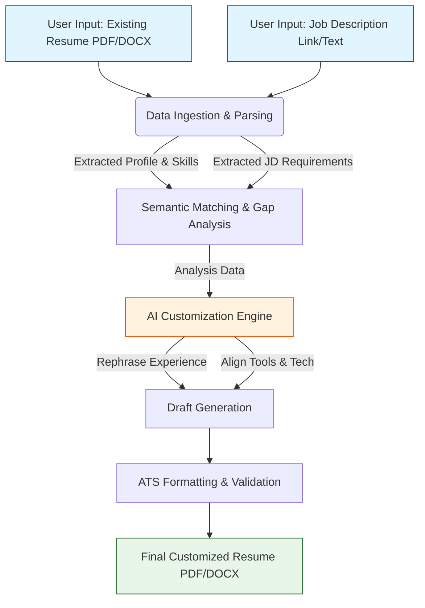
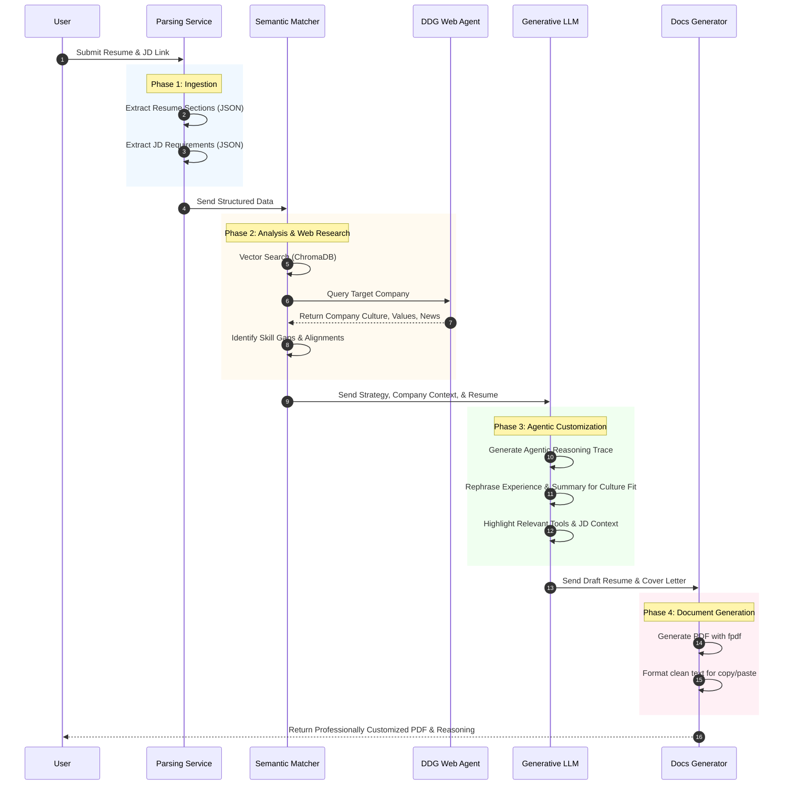

# AI Resume Matcher: Resume Customization Workflow

## Overview
This document outlines the workflow and architecture for the **Resume Customization Engine**. The objective is to correctly parse an existing resume and a target Job Description (JD), and then intelligently customize the resume. The customization involves rephrasing experiences, highlighting relevant tools, and adjusting technologies to align with the job role, all while adhering to strictly professional standards and ATS (Applicant Tracking System) best practices.

## High-Level Architecture

The below diagram illustrates the high-level data flow from user inputs to the generated ATS-optimized resume.

## Detailed Process Flow

### 1. Data Ingestion & Parsing (with TDD & Robust JSON)
*   **Resume Parsing:** Read and extract text from the user's existing resume. We utilize LangChain agents and NLP to break down the resume into discrete, structured JSON components: Profile, Professional Summary, Work Experience, Education, and Skills.
    *   **Robust Extraction:** The LLM's raw output is aggressively cleaned using heuristics (regex and AST fallbacks) to ensure nulls and structural errors are handled flawlessly.
*   **Job Description Parsing:** Scrape the provided JD link or parse the raw text. Extract key entities such as required skills, expected tools/technologies, experience level, and core responsibilities into strict Pydantic models.
    *   **TDD Validated:** This parsing layer acts as our source of truth. It is covered by a strict Test-Driven Development (TDD) pytest suite to guarantee downstream customizer stability.

### 2. Semantic Analysis & Gap Identification
*   **Vector Matching:** Compare the resume's parsed data against the JD's requirements using vector embeddings (e.g., ChromaDB). 
*   **Skill Gap Analysis:** Identify targeted keywords, tools, or skills required by the JD that are underrepresented or missing in the candidate's existing resume.
*   **Customization Strategy:** Create a targeted mapping of how existing resume bullets can be naturally adapted to include the targeted keywords without fabricating experience.

### 3. AI Customization Engine (Rephrasing)
This is the core of the customization process. The strategic mapping is passed to an LLM (e.g., Groq/Gemini/OpenAI) using specialized system prompts. The prompts enforce strict constraints:
*   **No Hallucination:** Absolutely no fabrication of experience or skills the candidate does not actually possess. The goal is re-framing, not inventing.
*   **Action-Oriented Bullet Points:** Ensure bullet points start with strong action verbs.
*   **Quantifiable Metrics:** Retain and emphasize any numbers, percentages, or metrics from the original resume.
*   **Seamless Keyword Integration:** Naturally weave in JD-specific tools and technologies into existing experience bullets.
*   **Summary & Skills Adjustment:** Rewrite the professional summary to directly address the target role and reorganize the skills section to prioritize the technologies mentioned in the JD.

### 4. ATS Optimization & Validation
*   **Formatting Constraints:** Ensure the output uses a standard, single-column layout with clean text. This prevents tracking systems from failing to parse the document. Complex tables, internal columns, graphics, or unusual fonts are stripped out.
*   **Keyword Density Validation:** Verify that the generated text has a balanced keyword presence. ATS penalize obvious "keyword stuffing." The text must remain highly professional and read naturally to human recruiters.

## Customization Sequence Diagram

The sequence diagram below shows the interactions between the services during the resume customization process.

## ATS Best Practices Adherence
To ensure maximum success rate through applicant tracking systems, the workflow adheres to the following rules:
*   **Standard Headings:** Conventional section titles are enforced (e.g., "Work Experience", "Education", "Skills") instead of creative variations like "My Journey".
*   **Clean Output Formatting:** The final output is generated into standard Markdown, which accurately translates into clean plain-text, PDF, or DOCX formats favoring ATS parsers. 
*   **Concise Language (No Noise):** Buzzwords that add no value are eliminated. The focus remains entirely on quantifiable achievements and relevant tool usage requested by the JD.
